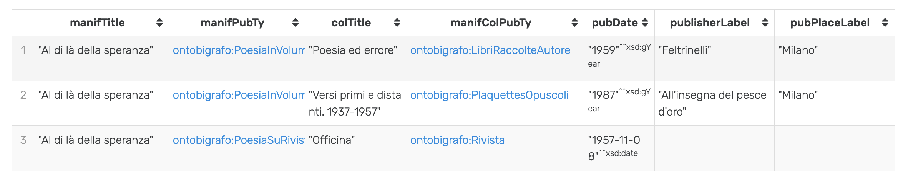
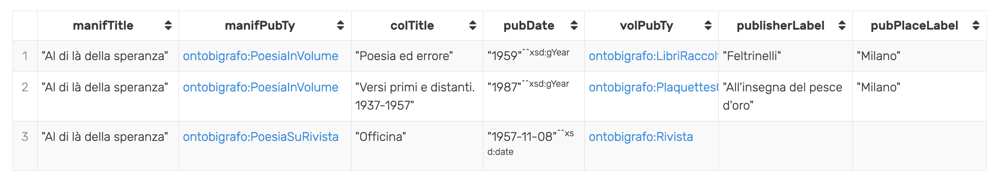
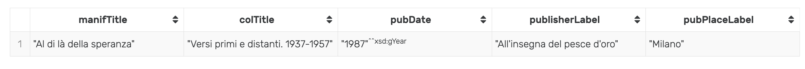

# BIGRAFO
Questa repository contiene i file relativi all'ontologia per il progetto BiGrafo nei linguaggi del Semantic Web. 
Il lavoro di ricerca sul progetto è attualmente in corso; pertanto sia l'ontologia, sia la sua istanziazione con i dati Bigrafo sono in fase di sviluppo e testing.  

## Ontologia BIGRAFO
L'ontologia Bigrafo (al momento non disponibile) è basata sulla famiglia delle SPAR Ontologies (http://www.sparontologies.net/) e in particolare su FaBio (http://www.sparontologies.net/ontologies/fabio).

Allo stato attuale si sta lavorando all'adattamento di FaBio per le esigenze di Bigrafo, ad es., rimuovendo alcune sotto-classi non necessarie al nostro contesto applicativo e aggiungendo allo stesso tempo vari elementi utili.

## Cartella RDFgraph
La cartella RDFgraph contiene esempi di dati rappresentati in RDF secondo l'ontologia Bigrafo.

Il file BIGRAFO_work_0001.ttl rappresenta - sotto forma di *test* - alcuni dati su "Al di là della speranza" di Franco Fortini in tre diverse manifestazioni:

- "Al di là della speranza", pubblicata nel volume "Poesia ed errore" (Feltrinelli, Milano, 1959);
- "Al di là della speranza", pubblicata nel volume "Versi primi e distanti. 1937-1957" (All'insegna del pesce d'oro, Milano, 1987);
- "Al di là della speranza", pubblicata sulla rivista "Officina" (8 novembre 1957).

## SPARQL query
Le seguenti query in SPARQL sono esempi per testare l'ontologia e la rappresentazione dei dati. Allo stato attuale, le query sono espresse su un triplestore RDF locale. Nel contesto del progetto, sarà data l'opportunità di accedere ai dati pubblicamenti tramite interfaccia Web.

Lista dei *namespaces* utilizzati nelle query:
```sparql
rdfs: <http://www.w3.org/2000/01/rdf-schema#>
fabio: <http://purl.org/spar/fabio/>
frbr: <http://purl.org/vocab/frbr/core#> # DA AGGIORNARE con LRMoo
dcterms: <http://purl.org/dc/terms/>
schema: <https://schema.org/>
prism:<http://prismstandard.org/namespaces/basic/2.0/>
ontobigrafo: <https://www.onto.bigrafo.it/> # NAMESPACE di TESTING
```

QUERY 1: seleziona le manifestazioni (_?manif_) del _work_ (_?work_) "Al di là della speranza". 
Per le manifestazioni, seleziona il titolo (_?manifTitle_), la tipologia di pubblicazione (_?manifPubTy_) e il testo di cui sono parte (_?manifCol_).
Inoltre, per questi ultimi testi, seleziona il titolo (_?colTitle_), la data di pubblicazione (_?pubDate_), il tipo di pubblicazione (_?manifColPubTy_) e - se disponibile (_OPTIONAL_) - il nome dalla casa editrice (_?publisherLabel_) e del luogo di pubblicazione (_?pubPlaceLabel_).

```sparql
SELECT ?manifTitle ?manifPubTy 
?colTitle ?manifColPubTy ?pubDate ?publisherLabel ?pubPlaceLabel
WHERE {
	?work a fabio:Work;
        schema:author/schema:name "Franco Fortini";
        dcterms:title "Al di là della speranza";
        fabio:hasManifestation ?manif.  
    
  ?manif dcterms:title ?manifTitle;
          ontobigrafo:hasPublicationType ?manifPubTy;
        	frbr:partOf ?manifCol.
    
  ?manifCol dcterms:title ?colTitle;
            prism:publicationDate ?pubDate;
            ontobigrafo:hasPublicationType ?manifColPubTy;
    
OPTIONAL
    {?manifCol dcterms:publisher/rdfs:label ?publisherLabel;
              fabio:hasPlaceOfPublication/rdfs:label ?pubPlaceLabel.}
} 
```
RESULT (via GraphDB by Ontotext, free version)



QUERY 2: Con lo scopo di semplificare l'interrogazione dei dati, questa è una variante della QUERY 1 in cui s'interroga direttamente la manifestazione senza il _work_ corrispondente. 
 
```sparql
SELECT ?manifTitle ?manifPubTy ?colTitle ?pubDate ?volPubTy ?publisherLabel ?pubPlaceLabel
WHERE { 
     	?manif a fabio:Manifestation;
               schema:author/schema:name "Franco Fortini";
 		dcterms:title ?manifTitle;  
         	ontobigrafo:hasPublicationType ?manifPubTy;
       		frbr:partOf ?manifCol.
   		

        ?manifCol dcterms:title ?colTitle;
                 prism:publicationDate ?pubDate;
                 ontobigrafo:hasPublicationType ?volPubTy.

	OPTIONAL{?manifCol dcterms:publisher/rdfs:label ?publisherLabel;
 			   fabio:hasPlaceOfPublication/rdfs:label ?pubPlaceLabel}  
 }
```


QUERY 3: seleziona le manifestazioni pubblicate tra il 1980 e il 1990 (_FILTER_) di tipo "poesia in volume" (_ontobigrafo:PoesiaInVolume_) e i testi in cui sono incluse.

```sparql
SELECT ?manifTitle ?colTitle ?pubDate ?publisherLabel ?pubPlaceLabel
WHERE {
	?manif a fabio:Manifestation;
               schema:author/schema:name "Franco Fortini";
    		dcterms:title ?manifTitle;  
         	ontobigrafo:hasPublicationType ontobigrafo:PoesiaInVolume;
       		frbr:partOf ?manifCol.
   		
        ?manifCol dcterms:title ?colTitle;
                 prism:publicationDate ?pubDate;
                 dcterms:publisher/rdfs:label ?publisherLabel;
		fabio:hasPlaceOfPublication/rdfs:label ?pubPlaceLabel

    FILTER (?pubDate >= "1980"^^xsd:gYear && ?pubDate <= "1990"^^xsd:gYear)
}
```



